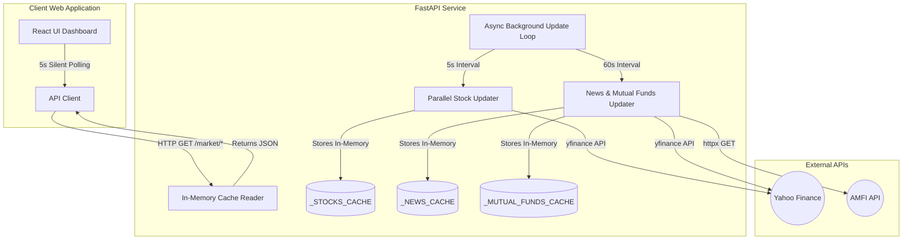

# 💰 Finity — Premium AI Financial Companion

Finity is a production-grade, premium fintech application designed to empower students and young earners in India to master their personal finances. Built with a minimalist, high-fidelity design language inspired by Notion and Stripe, Finity combines conversational AI coaching, advanced Monte Carlo investment simulations, real-time budgeting engines, and machine learning-powered loan eligibility prediction.

---

## ⚡ Real-Time Market Data Pipeline

Finity features a custom, lightweight, in-memory live market data pipeline that delivers real-time updates to the dashboard without permanent database storage or automated commits. 



### Key Performance Characteristics:
* **High-Frequency Refreshes:** Stock tickers (NIFTY 50, SENSEX, Apple, Microsoft, BTC, ETH) update every **5 seconds** using parallelised HTTP fetches via `asyncio.to_thread`.
* **Zero Database Overhead:** Eliminates SQLite disk writes for price tick data to keep local storage overhead at 0%.
* **Smart Rate-Limiting:** News headlines and Mutual Fund NAVs update every **60 seconds** to comply with external API limits.
* **Smart History Caching:** Historical charting endpoints fetch live and cache responses in-memory with a **1-hour Time-To-Live (TTL)**.

---

## ✨ Core Features

### 🤖 AI Financial Coach
* **Conversational Guidance:** Chat with an AI companion explaining complex concepts (SIPs, ELSS, 50/30/20, Tax Regimes) in simple terms.
* **Context-Aware Insights:** Tailors recommendation models based on user risk profiles.

### 📊 Advanced Investment Simulator
* **Wealth Projection:** Simulate portfolio growth over 30+ years using customized risk strategies.
* **Probabilistic Modeling:** Visualize expected, best-case, and worst-case outcomes using Monte Carlo-inspired chart boundaries.

### 🏦 Smart Budget Tracker
* **50/30/20 Rule Analysis:** Automatically categorizes expenditures into Needs, Wants, and Savings.
* **Visual Analytics:** Interactive charts comparing actual spending habits against recommended benchmarks.

### 🔮 Loan Eligibility Predictor (Loan Genie)
* **ML-powered Classifier:** Built on a Random Forest classification model to estimate loan approval probabilities.
* **Actionable Recommendations:** Delivers detailed scoring metrics alongside direct steps to improve eligibility.

### 🎓 Learning Academy
* **Bite-sized Lessons:** Gamified learning paths for essential personal finance concepts.
* **XP & Badges:** Level up, maintain activity streaks, and unlock achievements.

---

## 🛠️ Technology Stack

| Layer | Technologies |
| :--- | :--- |
| **Frontend** | React 18, Vite, TypeScript, Tailwind CSS, Framer Motion, Recharts, Zustand, Lucide Icons |
| **Backend** | FastAPI (Python 3.11), Uvicorn, httpx, Scikit-learn (Random Forest Model) |
| **Data Feed** | yfinance (Yahoo Finance API integration), AMFI (Association of Mutual Funds in India API) |
| **Deployment** | Docker, Docker Compose |

---

## 📂 Project Structure

```bash
Finity-/
├── backend/
│   ├── app/
│   │   ├── api/            # API Endpoints & Routes
│   │   ├── core/           # Configs & Security
│   │   ├── models/         # Pydantic schemas / ML wrappers
│   │   ├── services/       # Core business logic (market_db.py, simulator.py)
│   │   └── main.py         # Entry point
│   ├── database/           # DB schemas & local resources
│   ├── Dockerfile
│   └── requirements.txt
├── frontend/
│   ├── src/
│   │   ├── components/     # Shared UI components
│   │   ├── pages/          # Pages (Market.tsx, Dashboard.tsx, Chat.tsx)
│   │   ├── services/       # Frontend API client
│   │   └── main.tsx
│   ├── index.html
│   ├── Dockerfile
│   └── package.json
└── docker-compose.yml      # Orchestrates backend & frontend locally
```

---

## 🚀 Getting Started

Ensure you have [Docker](https://www.docker.com/) and [Docker Compose](https://docs.docker.com/compose/) installed on your machine.

### Run with Docker Compose

1. Clone the repository and navigate to the project directory:
   ```bash
   git clone https://github.com/ShashwatSahu21/Finity-.git
   cd Finity-
   ```

2. Build and launch both frontend and backend services:
   ```bash
   docker-compose up --build
   ```

3. Access the applications:
   * **Frontend Interface:** [http://localhost:5173](http://localhost:5173)
   * **Backend REST API:** [http://localhost:8000](http://localhost:8000)
   * **Swagger API Docs:** [http://localhost:8000/docs](http://localhost:8000/docs)

### Run Locally (Development Mode)

If you prefer to run the components directly on your host:

#### Backend:
```bash
cd backend
pip install -r requirements.txt
uvicorn app.main:app --reload --port 8000
```

#### Frontend:
```bash
cd frontend
npm install
npm run dev
```

---
*Created by [Shashwat Sahu](https://github.com/ShashwatSahu21) with ❤️ for financial freedom.*
